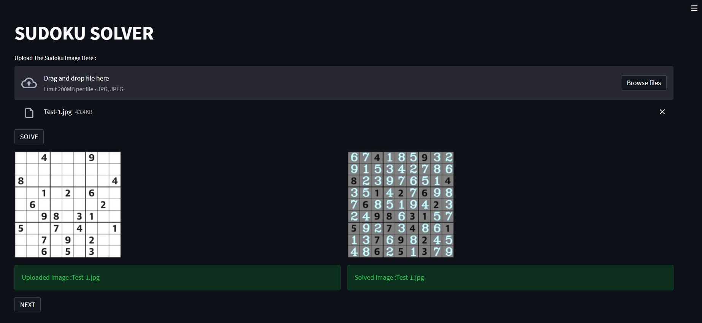
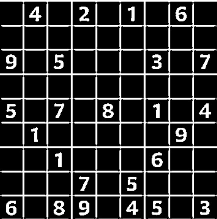
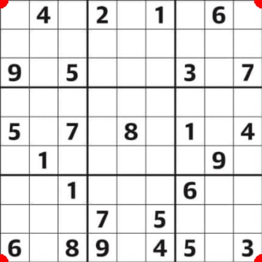
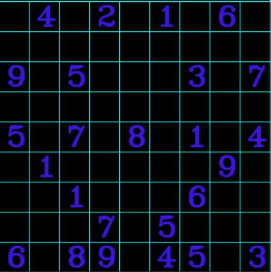
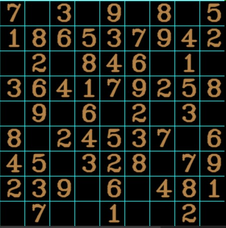
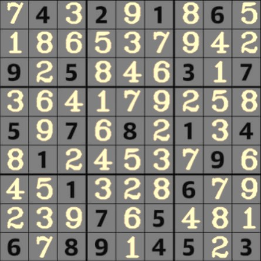

# Sudoku :

### Overview -
An application which solves a given sudoku problem based on OpenCV and Python. Initially, any sample unsolved is taken. The exact sudoku grid is extracted from the image by removing external contours and implementing warp-perspective. The entire grid (9 x 9) is then splitted into 81 boxes, either containing a digit or an empty space. A custom digit recognition model is used to identify the digits in each boxes. The model is loaded using the tensorflow library. A backtracking algorithm is implemented to solve the sudoku. The solution matrix is created and then overlayed over the original image to get the solved sudoku. 

### Technologies Used :

### Process Overflow -
The working is broadly dividen into three categories-

- Image Preprocessing
- Digit Separation and Classification 
- Solving sudoku
- Placing the solved values

    
  

